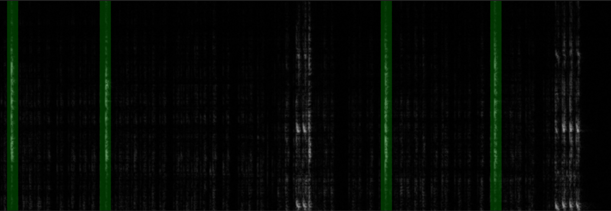

# Cricket
Software to recognize cricket courtship sounds from nature recordings.

## Example of recognized courtships sounds
 - Picutre below shows spectrogram of audio recording.
    
    - Recognized singular courtship sounds are marked as green area.

## Project Setup (development)
### Conan
Run the following command in project root directory:
```
conan install . --build=missing -s build_type=Release --output-folder=build
```

### Cmake build
Requires [libtorch](https://pytorch.org/get-started/locally/) (path set via `CMAKE_PREFIX_PATH` in `CMakeLists.txt`). Run the following command in the *build* directory:
```
cmake ..
cmake .. -DCMAKE_TOOLCHAIN_FILE=conan_toolchain.cmake -DCMAKE_BUILD_TYPE=Release
cmake --build .
```

## Usage (C++)
Run from the *build* directory (settings in `assets/config.json`). Inputs are picked through a file dialog.

### clipgen
Cuts the labeled tick/noise intervals (`assets/records/<rec>.json`) into training clips in `assets/clips/`.
```
./clipgen --clips [--format npy|png]
./clipgen --spectrograms   # full spectrogram PNG per recording
```

### clipclass
Classifies every `.wav` in the selected folders and writes `<rec>.clips.csv` and `<rec>.courtships.csv` to `output/<folder>/`.
```
./clipclass [--model cnn] [--clips] [--courtships]   # flags also save marked spectrogram PNGs
```

## Training (Python)
Run from the *src/train* directory. Model architectures are registered in `models.py`; `--model` picks one (default: `cnn`).

### evaluation.py
Leave-one-date-out cross-validation — trains a throwaway model per date to measure how well the approach generalizes. Writes metrics and confusion matrices to `output/evaluation/<model>/`.
```
python3 evaluation.py              # one model
python3 evaluation.py --model all  # every registered model
```

### main.py
Trains on all clips and exports the deployable model to `assets/models/<model>.pt` (loaded by `clipclass`).
```
python3 main.py
```

### stats.py
Prints labeled clip counts.
```
python3 stats.py [--by date|recording]
```
